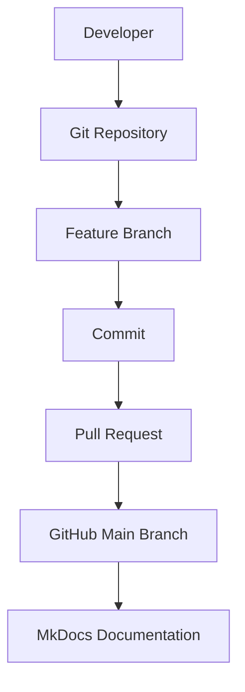

# Project Architecture

The Git Practice project uses Git and GitHub to manage source code and documentation.

```mermaid
flowchart TD
    A[Developer] --> B[Git Repository]
    B --> C[Feature Branch]
    C --> D[Commit]
    D --> E[Pull Request]
    E --> F[GitHub Main Branch]
    F --> G[MkDocs Documentation]
```
